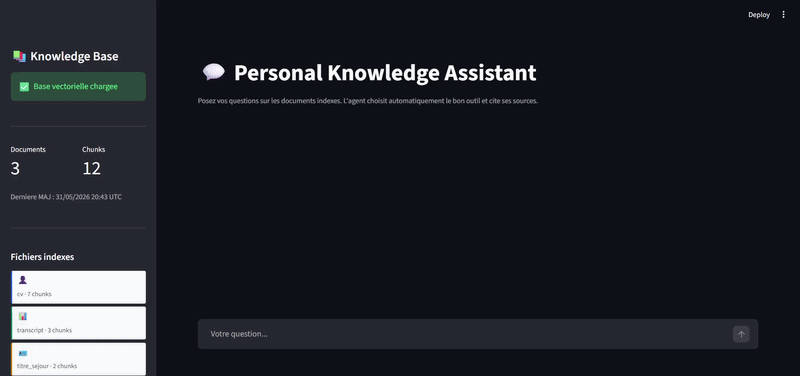

# Personal Knowledge Assistant

A local RAG agent that answers questions about your personal documents — résumés, transcripts, residence permits, contracts — using semantic search and an LLM.

> **Demo data:** the repo ships with three anonymised example documents based on the fictional character Subaru Natsuki (Re:Zero). Your real documents stay local and are never committed.

---

## Demo



---

## How it works

```
Your PDFs / images
      │
      ▼
┌─────────────┐    ┌──────────────┐    ┌───────────────┐
│   parser.py │───▶│  chunker.py  │───▶│  embedder.py  │
│ pymupdf+OCR │    │ overlap=150  │    │ all-MiniLM-L6 │
└─────────────┘    └──────────────┘    └───────┬───────┘
                                               │ upsert
                                        ┌──────▼──────┐
                                        │  ChromaDB   │
                                        │  (on disk)  │
                                        └──────┬──────┘
                                               │ query
                              ┌────────────────▼────────────────┐
                              │         LangGraph agent          │
                              │  router → search_kb /            │
                              │          extract_dates → Groq    │
                              └────────────────┬────────────────┘
                                               │
                                        ┌──────▼──────┐
                                        │  Streamlit  │
                                        │  chat UI    │
                                        └─────────────┘
```

---

## Stack

| Component | Choice | Why |
|---|---|---|
| PDF parsing | `pymupdf` + `pytesseract` | Native PDFs + scanned pages (OCR fallback) |
| Embeddings | `sentence-transformers/all-MiniLM-L6-v2` | Fast, good quality, runs on a 6 GB GPU |
| Vector store | `ChromaDB` (persistent) | Zero infra, local disk, easy metadata filtering |
| LLM | Groq API — `llama-3.3-70b-versatile` | Free tier, fast inference, reproducible for anyone |
| Agent | `LangGraph` | Explicit graph, easy to extend with new tools |
| Interface | `Streamlit` | Rapid demo UI |
| Evaluation | `RAGAS` *(planned)* | Faithfulness, answer relevancy, context recall |

---

## Features

**Ingestion pipeline**
- Parses native PDFs and scanned PDFs (OCR) — same code path, auto-detected per page
- Hierarchical chunker: splits on `\n\n` → `\n` → sentence boundaries → words, with configurable overlap
- All chunks stored in ChromaDB with metadata: `source_file`, `page_num`, `doc_type`, `is_ocr`
- `metadata.json` updated on every run — drives the Streamlit sidebar

**Agentic retrieval**
- Keyword-based router (no extra API call): dates/expiry → `extract_dates`; grades → transcript filter; CV → boosted k=8
- `extract_dates` tool scopes retrieval to `titre_sejour` and `contract` docs only
- Results ranked by cosine similarity, sources deduplicated by `(filename, page)`

**Streamlit UI**
- Persistent chat history across turns
- Sidebar: last ingestion date, doc count, chunk count, per-file breakdown
- Source cards under each answer: filename, page, doc type, relevance score

---

## Quickstart

### 1 — Clone and install

```bash
git clone https://github.com/Badri-Tib/agentic-personal-knowledge-assistant
cd agentic-personal-knowledge-assistant

python -m venv .venv
source .venv/bin/activate        # Windows: .venv\Scripts\activate

pip install -r requirements.txt
```

> **GPU (optional):** install the CUDA-enabled PyTorch wheel before the rest:
> ```bash
> pip install torch --index-url https://download.pytorch.org/whl/cu118
> pip install -r requirements.txt
> ```

> **OCR (optional):** scanned PDFs require [Tesseract](https://github.com/tesseract-ocr/tesseract).  
> The pipeline falls back to native text extraction if Tesseract is not installed.

### 2 — Add your Groq API key

```bash
cp .env.example .env
# edit .env and set GROQ_API_KEY=your_key_here
```

Get a free key at [console.groq.com](https://console.groq.com).

### 3 — Ingest documents

```bash
# Demo: ingest the anonymised example documents (no real docs needed)
python ingest.py

# Your own documents (gitignored):
python ingest.py --dir data/raw

# Full re-index (wipes ChromaDB first):
python ingest.py --dir data/raw --reset
```

### 4 — Launch the app

```bash
streamlit run app.py
```

Open [http://localhost:8501](http://localhost:8501).

### 5 — (Optional) Run the agent smoke test

```bash
python test_agent.py
```

---

## CLI reference

```
python ingest.py [--dir PATH] [--reset] [--chunk-size N] [--chunk-overlap N]
                 [--model MODEL] [--chroma-path PATH] [--verbose]

Defaults:
  --dir           data/examples
  --chunk-size    500
  --chunk-overlap 150
  --model         sentence-transformers/all-MiniLM-L6-v2
  --chroma-path   data/chroma_db
```

---

## Repo structure

```
agentic-personal-knowledge-assistant/
│
├── data/
│   ├── raw/                    # Your real documents — gitignored, never committed
│   └── examples/               # Anonymised demo documents (committed)
│
├── src/
│   ├── ingestion/
│   │   ├── parser.py           # pymupdf + pytesseract, auto OCR fallback
│   │   ├── chunker.py          # Hierarchical splitter, configurable overlap
│   │   └── embedder.py         # sentence-transformers → ChromaDB upsert
│   ├── retrieval/
│   │   └── retriever.py        # Cosine search + doc_type filtering
│   ├── agent/
│   │   ├── tools.py            # search_kb, extract_dates, routing heuristic
│   │   └── graph.py            # LangGraph: router → retrieval → generate
│   └── utils/
│       └── metadata.py         # Read / write metadata.json
│
├── scripts/
│   └── generate_fake_docs.py   # Regenerate the example PDFs (pymupdf)
│
├── app.py                      # Streamlit chat interface
├── ingest.py                   # Ingestion CLI
├── test_agent.py               # End-to-end smoke test (3 canonical questions)
├── metadata.json               # Updated by ingest.py, read by the sidebar
├── requirements.txt
└── .env.example
```

---

## Example documents

The `data/examples/` directory contains three anonymised PDFs generated with `scripts/generate_fake_docs.py`. They are based on a fictional character and contain no real personal data.

| File | Type | What it tests |
|---|---|---|
| `cv_subaru_natsuki.pdf` | `cv` | Multi-page CV, bullet-point experiences, skills table |
| `releve_notes_m1.pdf` | `transcript` | Grades table, mentions, jury notes |
| `titre_sejour_exemple.pdf` | `titre_sejour` | Expiry date extraction (`31/08/2027`) |

**Example questions to try:**

```
Quand est-ce que le titre de sejour expire ?
Quelle note a obtenu Subaru en Apprentissage par Renforcement ?
Quelles sont les experiences professionnelles de Subaru ?
Resume les competences techniques de Subaru pour une lettre de motivation.
```

To regenerate the PDFs (e.g. after modifying the content):

```bash
python scripts/generate_fake_docs.py
python ingest.py --reset
```

---

## Environment variables

| Variable | Required | Description |
|---|---|---|
| `GROQ_API_KEY` | Yes | Groq API key — get one free at console.groq.com |
| `GROQ_MODEL` | No | Override the default model (`llama-3.3-70b-versatile`) |

---

## Roadmap

- [ ] RAGAS evaluation pipeline (`src/evaluation/ragas_eval.py`)
- [ ] Reranker (`src/retrieval/reranker.py`) — cross-encoder on top of vector search
- [ ] Multi-turn conversation memory in the agent graph
- [ ] Support for `.docx` and plain text files in the parser

---

## License

MIT
